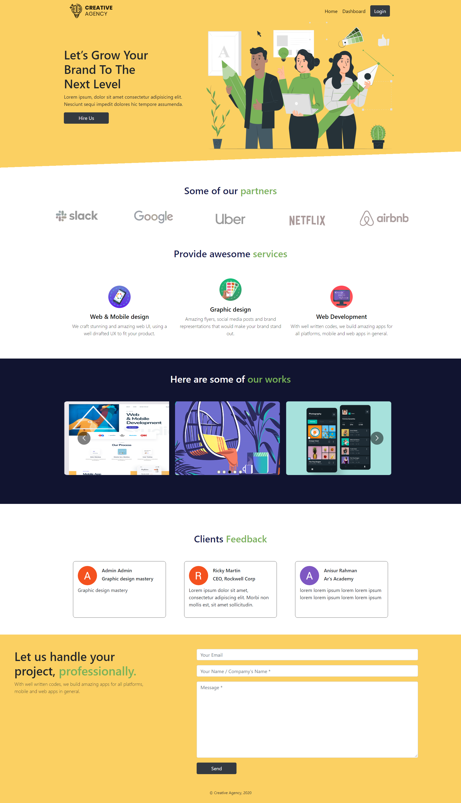
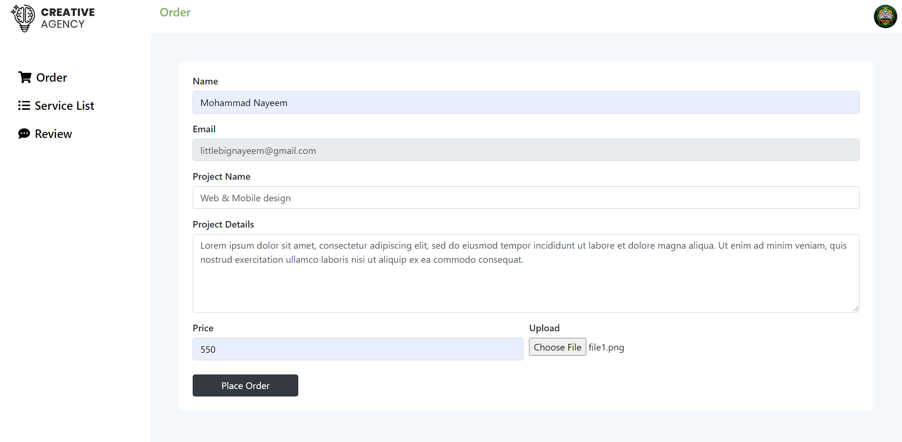
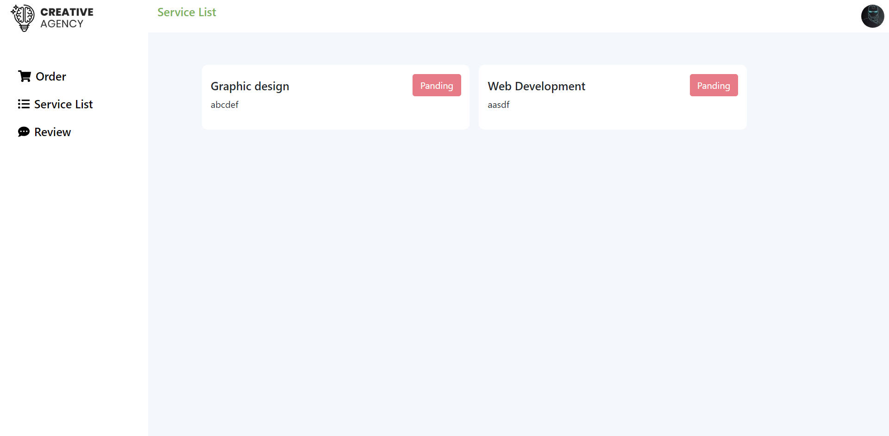
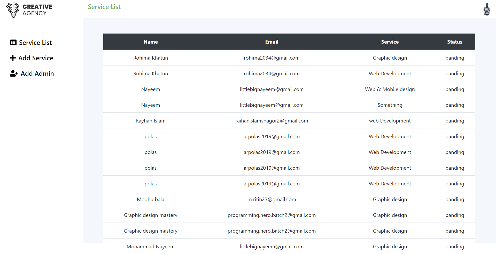

# Creative Agency - A fullstack service selling SPA [`LIVE`](https://creative-agency-20.web.app/)
A full stack service selling single page web application with responsive UI.
## Features
This is a fullstack service selling single page web application with responsive UI. It’s developed by using React, MongoDB, Firebase, JS, ES6, React, React-Router, Html, CSS and reactBootstrap.

#### Client 
- User can order his/her desire service.
- User can upload file as a sample that will be stored in MongoDB.
- Also user can give a review of his/her order.
- User will be able to see his/her order progress through the status in dashboard.

#### Admin
- Admin can add new services and manage users order.
- An admin add more admins.
- Admin will be able to manage the status of users order.
- Admin will be able to see all of their pending, ongoing or finished order status

### [`Backend Repository`](https://github.com/readwanmd/CreativeAgency-Server)

 

